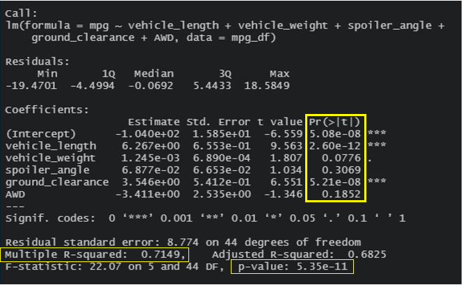
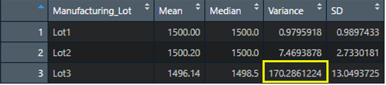
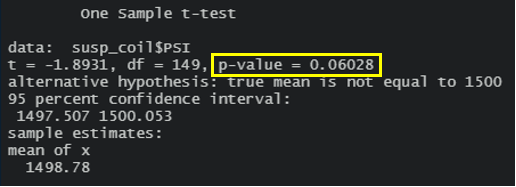
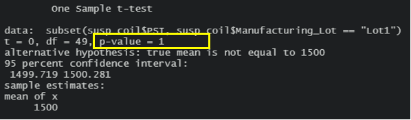
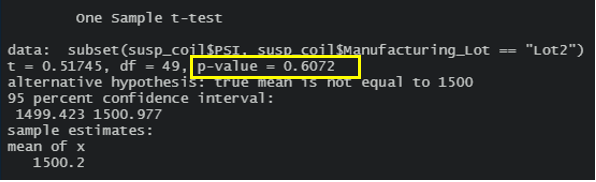
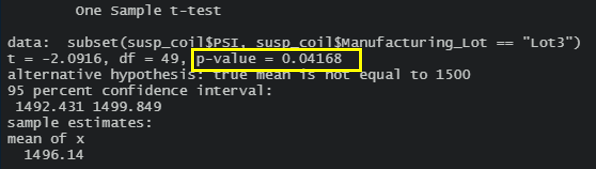

# MechaCar Statistical Analysis
Analysis on MechaCar, the newest prototype car manufactured by AutosRUs.

## Linear Regression to Predict MPG
A **Multiple Linear Regression** analysis was done on the dataset to see the interactions between all variables. The results showed how Miles per Gallon (MPG) responded to changes in Vehicle Length, Vehicle Weight, Spoiler Angle, Ground Clearance, and Drive Train (AWD). The **Summary Statistics** are displayed below.

- Which variables/coefficients provided a non-random amount of variance to the mpg values in the dataset?
There are two variables that fall under the threshold of the test statistic of 0.05. They are Vehicle Length and Ground Clearance. Note that the p-value for the Intercept is also below 0.05. This could mean that there are other variables that contribute to the variability of the MPG of the vehicle.

- Is the slope of the linear model considered to be zero? Why or why not?
The null hypothesis for the analysis would be that the slope of the linear model is zero. But the analysis show that the overall p-value of the analysis is 5.35e-11 which is significantly less than the test standard statistic of 0.05. This means that there is sufficient evidence to say that the slope of the regression model is not Zero.

- Does this linear model predict mpg of MechaCar prototypes effectively? Why or why not?
When all variables are taken into consideration, the summary statistics for the linear model calculates an R-Squared value of 0.7149. That is to say that this linear model is about 71% effective in predicting the MPG of the MechaCar prototypes.

## Summary Statistics on Suspension Coils
The summary statistics derived from the total collection of the Suspension Coil data is shown below.

The data show at a high level, when all coils are considered, the variance is at 62.3 pounds per square inch (psi) which is below the specification of 100 psi. Although, when the coils are separated by their lot IDs, the variance for Lot3 is outside the acceptable upper limit of 100 psi.

## T-tests on Suspension Coils

### Summary Statistics for All Manufacturing Lots
The null hypothesis in general is to state that there is no difference in the sample and nominal (mu=1500) means. With that said, when we look at the summary statistics for the total population as seen in the figure below, we see that the calculated p-value is 0.06. When compared to the standard test statistic of 0.05, the calculated p-value is greater than the test value. Therefore, we do not have sufficient evidence to reject the stated null hypothesis, and we state that the two means are statistically similar. 

### Summary Statistics of the Coils by Lot
 *Lot1:* The statistical summary T-test for Lot1 shows that the sample mean compared to the nominal mean of 1500 psi, the calculated p-value is 1.0. If we compare this p-value to the standard test statistic of 0.05, the calculated values is greater than the 0.05. The meaning of this outcome is that there is not enough evidence to reject the null hypothesis. Therefore, we would reject the hypothesis and state that the means are statistically similar.

 

*Lot2:* The calculated p-value from the summary statistics for Lot2 is 0.06, which is higher than the test statistic of 0.05. Therefore, again we will reject the null hypothesis and state that the two means are statistically similar.

 

*Lot3:* In the case of Lot3 we see that the calculated p-value is 0.04 which is less than the test statistic of 0.05. In this case we will fail to reject the null hypothesis and state that the two means are statistically different.

 

## Study Design: MechaCar vs. Competition
*Metric to Test:* I would like to select **Rear Passenger Legroom** as the metric to test. The metric will be measured at two positions. Position 1 is while the front driver/passenger seat is in the most forward position and Position 2 is while the driver/passenger seat is scooted to the farthest back position. The distance of Legroom will be measured from the front of the rear seat to the back of the front seat (in upright position).

*Null Hypothesis:* There is no difference in the measured legroom of MechaCar and the Competition. MechaCar Mean = Competitor Mean

*Alternate Hypothesis:* There is a difference between the measured legroom of MechaCar and the Competition.

When comparing the sample means of MechaCar and Competition, I would use a two sample T-test. This is done because we are comparing two sample means (not a sample mean against a nominal value). Also, I will state at this point that a longer measured legroom is considered a better value.

Legroom data, as described in the 'Metric to Test' section will need to be collected from the MechaCar manufacturing and all competitor models. The sample size will depend on how precise you need to be. For this study I would pick 50 each from the MechaCar and Competitor brand. This should be adequate if we are only comparing MechaCar to a total population of competitor cars. The calculus will change if we need to compare the results across individual competitors. In this case more samples will need to be measured.

